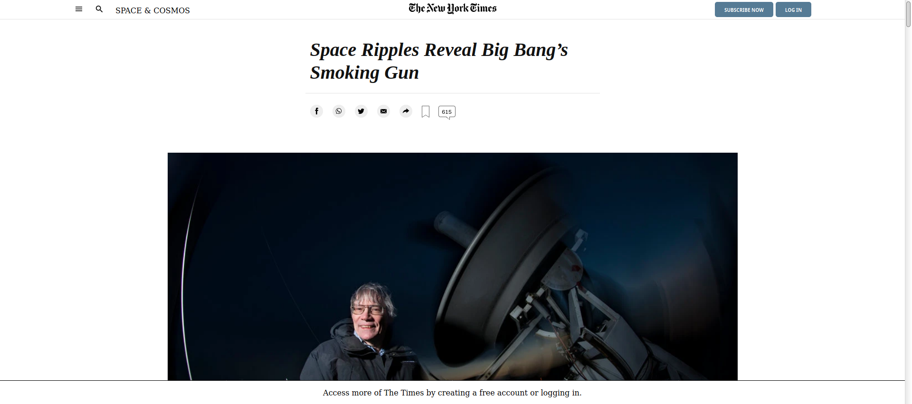

# HTML 2.0 - Project 1: Positioning and Floating Elements

> One paragraph statement about the project.

The goal of this project is to clone the following page from The New York Times: https://www.nytimes.com/2014/03/18/science/space/detection-of-waves-in-space-buttresses-landmark-theory-of-big-bang.html?_r=0 .
To achieve this, the project makes use of HTML5 and CSS3 and focuses on making use of the positional aspects of the project with display: grid, display: flex and float:left/right

## Built With

- HTML5 , CSS3
- Windows, Linux

## Live Demo

[Live Demo Link](https://vitorelourenco.github.io/NewYorkTimesClone/)

## Getting Started

**This is an example of how you may give instructions on setting up your project locally.**
**Modify this file to match your project, remove sections that don't apply. For example: delete the testing section if the currect project doesn't require testing.**

To get a local copy up and running follow these simple example steps.

### Prerequisites

-Windows or Linux machine 
-Web browser other than Internet Explorer

### Setup

-Download the files to the same folder and run index.html

### Install

-No instalation required

### Deployment

-You can deploy this project cloning it on GitHub and then going to:
->Repository
->Settings
->GitHub Pages
(Select source)
->Save

The project will be deployed to https://<yourgithubusername>.github.io/<repositorysname>/

## Authors

👤 **Author1**

- GitHub: [@vitorelourenco](https://github.com/vitorelourenco)
- Twitter: [@Vitorel](https://twitter.com/Vitorel)
- LinkedIn: [vitoremanuellourenco](https://www.linkedin.com/in/vitoremanuellourenco/)

👤 **Author2**

- GitHub: [@#](https://#)
- Twitter: [@#](https://#)
- LinkedIn: [#](https://#)

## 🤝 Contributing

Contributions, issues, and feature requests are welcome!

Feel free to check the [issues page](https://github.com/vitorelourenco/NewYorkTimesClone/issues).

## Show your support

Give a ⭐️ if you like this project!

## Acknowledgments

- The New York Times (https://www.nytimes.com/)
- Microverse (https://www.microverse.org/)
- The Odin Project (https://www.theodinproject.com/)

## 📝 License

This project is [MIT](lic.url) licensed.

